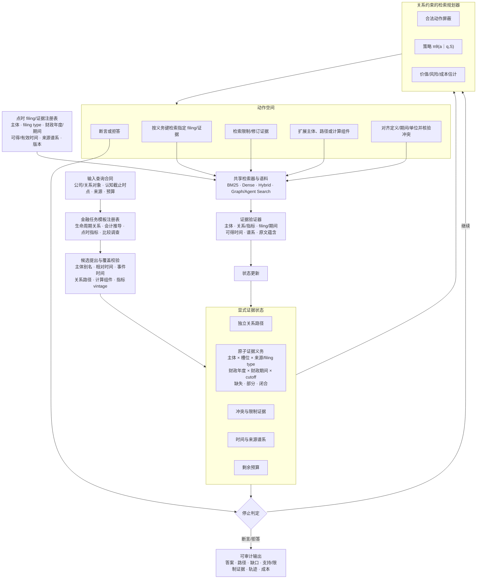

# FinPlan-RAG 中文框架图

## 图注

FinPlan-RAG 在共享语料和检索器之上维护显式证据状态。金融任务模板只规定各轨道的证据义务和合法动作，规划策略根据当前分支闭包、限制/修订证据、时间状态与预算选择下一步。文件义务不能只写成“公司—年份”：混合 10-K/10-Q 实验表明，同年 Q1/Q2/Q3/FY 会发生状态碰撞，因此现行义务键显式包含 filing type 与财政期间；中国披露对应证券代码、公告类型、报告年度/期间和公告可得时间。生命周期关系、会计推导、点时指标和比较调查共享状态接口，但不共享未经验证的闭包规则。每轮结果经验证后更新状态，直至满足断言条件或触发拒答。v7 在新冻结 validation6 闭包 6/8，未超过同元数据强基线；图示是候选方法规格，不代表已达到 SOTA。
